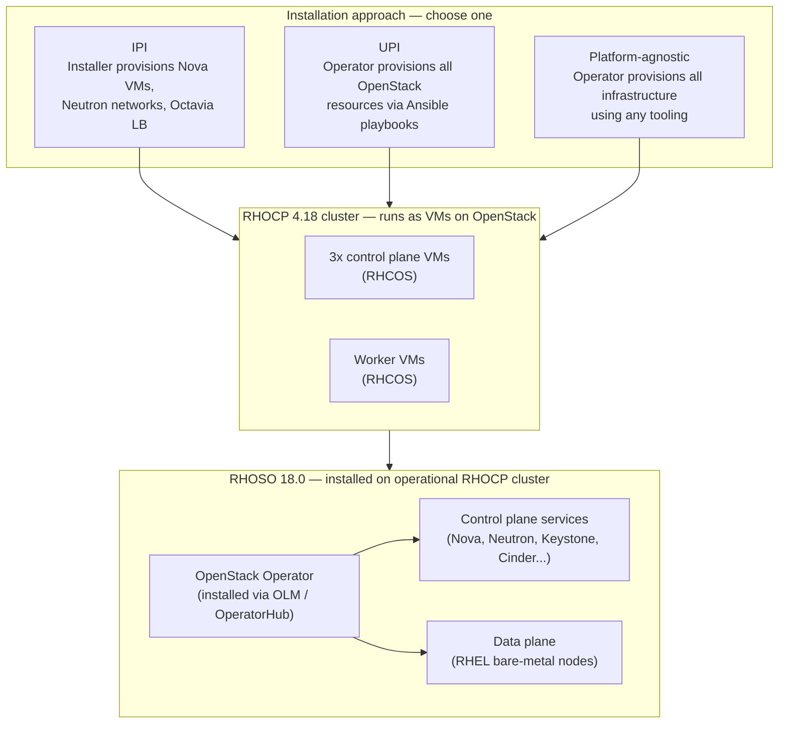
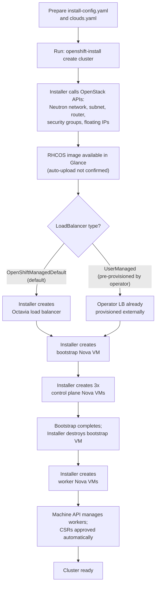
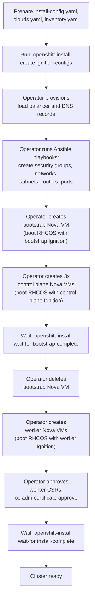
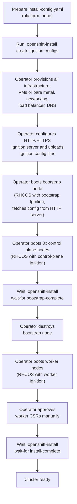
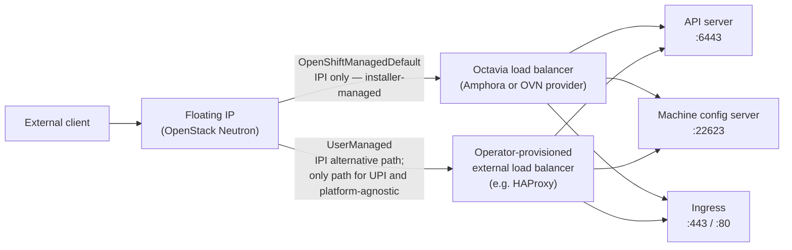
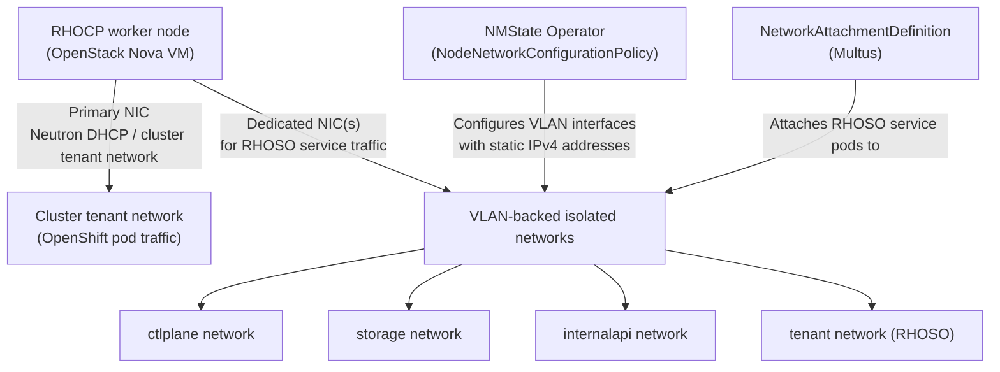
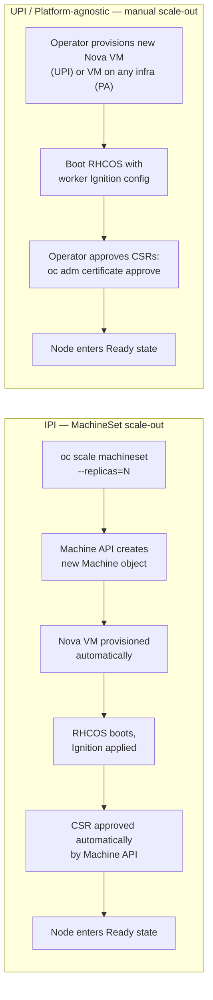
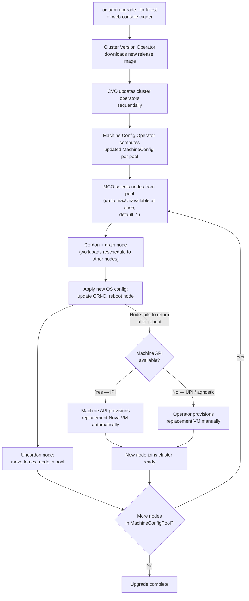
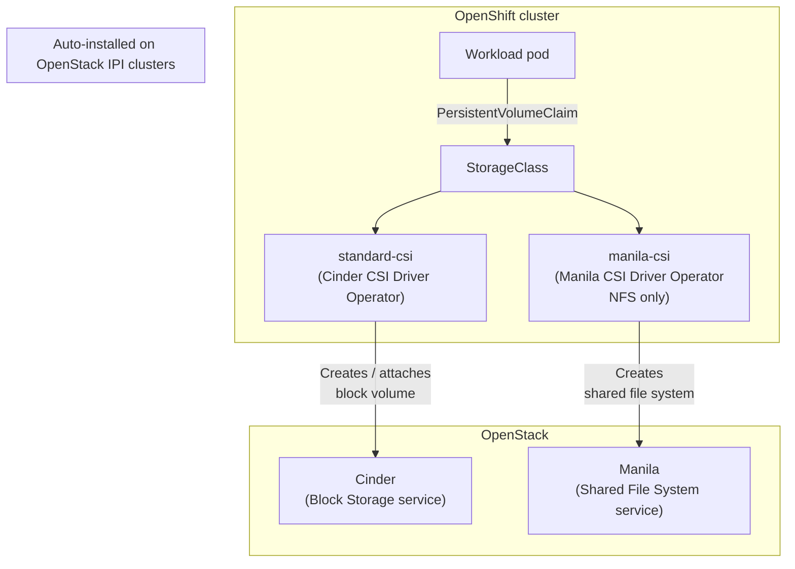

# OpenShift Deployment Approach Comparison on RHOSO OpenStack Infrastructure

**OpenShift Container Platform version:** 4.18  
**Red Hat OpenStack Services on OpenShift version:** 18.0  
**Date:** 2026-05-06

This document compares three approaches to installing Red Hat OpenShift Container Platform (RHOCP) 4.18 when the cluster runs as virtual machines on Red Hat OpenStack Services on OpenShift (RHOSO) 18.0 infrastructure. The three approaches are: installer-provisioned infrastructure (IPI), user-provisioned infrastructure (UPI), and the platform-agnostic (any-platform) method.

This document is about how OpenShift itself is installed and operated on top of OpenStack. It is not about RHOSO deployment modes. RHOSO 18.0 is installed on an already-operational RHOCP cluster after the OpenShift installation is complete. The choice of OpenShift installation approach affects how that substrate is created, maintained, and scaled, which in turn affects how RHOSO operates on top of it.

---

## Section 1: At a Glance

The table below summarises the six most decision-relevant differences between the three installation approaches.

| Characteristic | IPI | UPI | Platform-agnostic |
|---|---|---|---|
| Who provisions infrastructure | OpenShift installer | Operator (using Ansible playbooks) | Operator (fully manual) |
| Load balancer responsibility | Installer provisions Octavia LB by default (OpenShiftManagedDefault); operator provisions external LB on UserManaged path | Operator provisions LB before installation | Operator provisions LB before installation |
| Machine API availability | Available; MachineSets can scale Nova VMs automatically | UPI installations do not have machine sets ([OCP 4.18 Machine management](https://docs.redhat.com/en/documentation/openshift_container_platform/4.18/html/machine_management/managing-user-provisioned-infrastructure-manually)) | Not available (platform type `none`) |
| Node scale-out method | `oc scale machineset --replicas=N` | Operator creates Nova VM, boots RHCOS, approves CSRs | Operator creates VM, boots RHCOS, approves CSRs |
| CSI storage (Cinder / Manila) | Cinder CSI installed automatically; Manila CSI installed automatically when Manila service is enabled | Red Hat documentation states CSI drivers install on "any OpenStack cluster"; whether this explicitly covers UPI-installed clusters is an open item — see Section 10 | Not auto-installed (platform type `none` has no OpenStack provider integration) |
| Key prerequisite | clouds.yaml, external network, sufficient quota; Octavia service (default path) or external LB (UserManaged path) | clouds.yaml, external network, Ansible collections, pre-provisioned LB and DNS | HTTP/HTTPS Ignition server, pre-provisioned LB, DNS, and all infrastructure |

---

## Section 2: Architecture Context

RHOSO 18.0 is not installed directly on bare metal or directly on OpenStack. It is installed on an operational RHOCP cluster. That RHOCP cluster in the context of this document runs as Nova VMs on OpenStack. The choice of OpenShift installation approach determines how those Nova VMs are created and how the cluster is managed over time.

RHOSO deployment begins only after the RHOCP cluster is operational. The RHOSO OpenStack Operator is installed on RHOCP via the OperatorHub using OLM by creating an OperatorGroup and Subscription custom resource in the `openstack-operators` namespace. The RHOSO control plane and data plane are then created as custom resources on the cluster.

The installation approach used for RHOCP does not change this sequence, but it does determine whether Machine API is available for ongoing RHOCP node management and whether OpenStack CSI drivers are installed automatically.

Sources: [RHOSO 18.0 — Installing and preparing the Operators](https://docs.redhat.com/en/documentation/red_hat_openstack_services_on_openshift/18.0/html/deploying_red_hat_openstack_services_on_openshift/assembly_installing-and-preparing-the-operators); [RHOSO 18.0 — Infrastructure and system requirements](https://docs.redhat.com/en/documentation/red_hat_openstack_services_on_openshift/18.0/html/planning_your_deployment/assembly_infrastructure-and-system-requirements).

---

## Section 3: Installation Comparison

### How each approach works

**IPI on OpenStack**

With installer-provisioned infrastructure, the OpenShift installation program provisions OpenStack resources directly by calling OpenStack APIs on behalf of the operator. The installer reads a `clouds.yaml` file and an `install-config.yaml` file, then creates Neutron networks, subnets, routers, security groups, floating IPs, a bootstrap Nova VM, three control plane Nova VMs, and worker Nova VMs. On the default load balancer path (`OpenShiftManagedDefault`), the installer also creates an Octavia load balancer for the API and Ingress endpoints. On the `UserManaged` path, the operator provisions the load balancer externally before running the installer and sets `platform.openstack.loadBalancer.type: UserManaged` in `install-config.yaml`, in which case the installer does not create an Octavia load balancer.

The bootstrap VM is destroyed automatically after the control plane is healthy. Machine API is fully available after IPI installation, and MachineSets can be used to scale the compute plane by provisioning new Nova VMs.

Source: [OCP 4.18 — Installing a cluster on OpenStack with customizations](https://docs.redhat.com/en/documentation/openshift_container_platform/4.18/html/installing_on_openstack/installing-openstack-installer-custom); [OCP 4.18 — Load balancing on RHOSP](https://docs.redhat.com/en/documentation/openshift_container_platform/4.18/html/ingress_and_load_balancing/load-balancing-openstack).

**UPI on OpenStack**

With user-provisioned infrastructure on OpenStack, the operator provisions all OpenStack resources manually or with the Ansible playbooks provided by Red Hat. The installation program generates Ignition configuration files, which the operator then uses to boot RHCOS nodes. The operator is responsible for creating Neutron networks, ports, security groups, the load balancer, DNS records, the bootstrap Nova VM, control plane VMs, and worker VMs. Ansible playbooks provided in the installation documentation simplify the creation of security groups, networks, subnets, routers, and ports.

After the bootstrap process completes, the operator deletes the bootstrap VM and approves the worker certificate signing requests (CSRs) manually. The resulting cluster has platform type `openstack` with infrastructure provisioning handled by the operator.

Source: [OCP 4.18 — Installing a cluster on OpenStack on your own infrastructure](https://docs.redhat.com/en/documentation/openshift_container_platform/4.18/html/installing_on_openstack/installing-openstack-user).

**Platform-agnostic (any platform)**

The platform-agnostic installation method uses the OpenShift installation program to generate Ignition configuration files but does not require or use any OpenStack-specific provider integration. The operator is responsible for provisioning all infrastructure — VMs or bare metal, networking, load balancing, DNS, and storage — using any available tooling. RHCOS nodes fetch their Ignition configs from an HTTP or HTTPS server that the operator must provide during installation. During the initial boot, the machines require an IP address configuration set either through a DHCP server or statically by providing the required boot options.

The resulting cluster has platform type `none`, which means Machine API is not available and the cluster cannot use MachineSet-based scaling. Every node lifecycle operation — adding workers, replacing failed nodes, upgrading OS configuration — requires manual operator action.

Source: [OCP 4.18 — Installing a cluster on any platform](https://docs.redhat.com/en/documentation/openshift_container_platform/4.18/html/installing_on_any_platform/installing-platform-agnostic); [OCP 4.18 — Machine management: Managing user-provisioned infrastructure manually](https://docs.redhat.com/en/documentation/openshift_container_platform/4.18/html/machine_management/managing-user-provisioned-infrastructure-manually).

---

### Responsibility matrix

| Task | IPI | UPI | Platform-agnostic |
|---|---|---|---|
| Create Nova VMs (bootstrap, control plane, workers) | Installer | Operator | Operator |
| Create Neutron network / subnet / router | Installer | Operator (Ansible playbooks available) | Operator |
| Create security groups | Installer | Operator (Ansible playbooks available) | Operator |
| Upload RHCOS image to Glance | Not confirmed in the referenced Red Hat documentation whether the installer uploads RHCOS automatically or uses a pre-uploaded image | Operator | N/A (no Glance integration) |
| Provision load balancer (API + Ingress) | Installer creates Octavia LB (default path) or Operator provisions external LB (UserManaged path) | Operator | Operator |
| Configure DNS records | Installer | Operator | Operator |
| Generate Ignition configs | Installer (internal) | Installer (`openshift-install create ignition-configs`) | Installer (`openshift-install create ignition-configs`) |
| Approve worker CSRs | Automated (Machine API) | Operator (`oc adm certificate approve`) | Operator (`oc adm certificate approve`) |

Sources: [OCP 4.18 — Installing on OpenStack with customizations](https://docs.redhat.com/en/documentation/openshift_container_platform/4.18/html/installing_on_openstack/installing-openstack-installer-custom); [OCP 4.18 — Installing on OpenStack on your own infrastructure](https://docs.redhat.com/en/documentation/openshift_container_platform/4.18/html/installing_on_openstack/installing-openstack-user); [OCP 4.18 — Installing on any platform](https://docs.redhat.com/en/documentation/openshift_container_platform/4.18/html/installing_on_any_platform/installing-platform-agnostic).

---

### IPI installation workflow

Sources: [OCP 4.18 — Installing on OpenStack with customizations](https://docs.redhat.com/en/documentation/openshift_container_platform/4.18/html/installing_on_openstack/installing-openstack-installer-custom); [OCP 4.18 — Load balancing on RHOSP](https://docs.redhat.com/en/documentation/openshift_container_platform/4.18/html/ingress_and_load_balancing/load-balancing-openstack).

---

### UPI installation workflow

Source: [OCP 4.18 — Installing a cluster on OpenStack on your own infrastructure](https://docs.redhat.com/en/documentation/openshift_container_platform/4.18/html/installing_on_openstack/installing-openstack-user).

---

### Platform-agnostic installation workflow

Source: [OCP 4.18 — Installing a cluster on any platform](https://docs.redhat.com/en/documentation/openshift_container_platform/4.18/html/installing_on_any_platform/installing-platform-agnostic).

---

### Prerequisites comparison

| Prerequisite | IPI | UPI | Platform-agnostic |
|---|---|---|---|
| Octavia service | Required (default path); not required on UserManaged path | Not required | Not required |
| External network in OpenStack | Required | Required | Not applicable |
| clouds.yaml | Required | Required | Not applicable |
| Ansible collections + Python modules | Not required | Required | Not applicable |
| DNS records (pre-install) | Installer creates | Operator must create before booting nodes | Operator must create before booting nodes |
| HTTP/HTTPS Ignition server | Not required | Not required | Required |
| Load balancer (pre-install) | Not required (default path); required before running installer (UserManaged path) | Required before running Ansible playbooks | Required before booting bootstrap node |

Sources: [OCP 4.18 — Installing on OpenStack with customizations](https://docs.redhat.com/en/documentation/openshift_container_platform/4.18/html/installing_on_openstack/installing-openstack-installer-custom); [OCP 4.18 — Installing on OpenStack on your own infrastructure](https://docs.redhat.com/en/documentation/openshift_container_platform/4.18/html/installing_on_openstack/installing-openstack-user); [OCP 4.18 — Installing on any platform](https://docs.redhat.com/en/documentation/openshift_container_platform/4.18/html/installing_on_any_platform/installing-platform-agnostic).

---

### Installation limitations

| Mode | Limitation | Impact |
|---|---|---|
| IPI | Octavia must be available on the default load balancer path; UserManaged path requires operator-provisioned LB before install | Adds pre-install dependency on Octavia service or external LB |
| IPI | Installer controls network topology; non-standard topologies require post-install configuration | Limits network customisation during install |
| IPI | OpenStack quota must accommodate all installer-created resources (Nova, Neutron, Cinder, Octavia) | Quota planning must be done before running the installer |
| UPI | Operator is responsible for all OpenStack resource creation and lifecycle | Increases pre-install effort; errors in Ansible inventory or playbooks can cause installation failure |
| UPI | UPI installations do not have machine sets (per OCP 4.18 Machine management documentation) | Node scaling requires manual Nova VM provisioning and CSR approval |
| Platform-agnostic | Platform type `none`; Machine API not available | All node lifecycle operations are manual |
| Platform-agnostic | No OpenStack provider integration; Cinder and Manila CSI auto-installation not confirmed | Persistent storage for workloads requires manual CSI driver configuration |

Sources: [OCP 4.18 — Installing on OpenStack with customizations](https://docs.redhat.com/en/documentation/openshift_container_platform/4.18/html/installing_on_openstack/installing-openstack-installer-custom); [OCP 4.18 — Installing on any platform](https://docs.redhat.com/en/documentation/openshift_container_platform/4.18/html/installing_on_any_platform/installing-platform-agnostic); [OCP 4.18 — Machine management: Managing user-provisioned infrastructure manually](https://docs.redhat.com/en/documentation/openshift_container_platform/4.18/html/machine_management/managing-user-provisioned-infrastructure-manually).

---

### Pros and cons

| Mode | Pros | Cons |
|---|---|---|
| IPI | Installer automates Nova VM creation, Neutron networking, floating IPs, and (default path) Octavia LB; Machine API available after install for automated scaling and node replacement; Cinder and Manila CSI installed automatically on OpenStack clusters | Requires Octavia (default path) or pre-provisioned external LB (UserManaged); less flexibility for custom network topologies during install; OpenStack quota must cover all installer-created resources |
| UPI | Operator controls all OpenStack resources; integration with existing network topology is possible; Octavia is not required | Higher pre-install effort; operator must correctly configure Ansible inventory and playbooks; UPI installations do not have machine sets; manual CSR approval required |
| Platform-agnostic | No dependency on OpenStack-specific credentials or APIs during install; suitable for disconnected or restrictive environments | No OpenStack provider integration; Machine API not available; Cinder and Manila CSI auto-installation not confirmed; all infrastructure lifecycle is manual; highest pre-install and day-2 operational effort |

Sources: [OCP 4.18 — Installation overview](https://docs.redhat.com/en/documentation/openshift_container_platform/4.18/html/installation_overview/ocp-installation-overview); [OCP 4.18 — Installing on OpenStack with customizations](https://docs.redhat.com/en/documentation/openshift_container_platform/4.18/html/installing_on_openstack/installing-openstack-installer-custom); [OCP 4.18 — Installing on any platform](https://docs.redhat.com/en/documentation/openshift_container_platform/4.18/html/installing_on_any_platform/installing-platform-agnostic).

---

## Section 4: Networking

Networking for OpenShift on OpenStack has two distinct layers that must both be designed and configured. The first is the OpenShift cluster network layer: the VMs that run control plane and worker nodes, the load balancer that exposes the API and Ingress endpoints, and the DNS records that clients use to reach those endpoints. The second is the RHOSO isolated network layer: dedicated VLANs attached to worker nodes so that RHOSO services can communicate over separate, isolated networks for control-plane traffic, storage traffic, and tenant network traffic.

### Load balancer paths

OpenShift on OpenStack supports two load balancer paths. The path is selected in `install-config.yaml` via `platform.openstack.loadBalancer.type`.

On the `OpenShiftManagedDefault` path, the installer (IPI only) provisions and manages an Octavia load balancer. OpenShift Container Platform clusters on RHOSP use Octavia to handle load balancer services, and Octavia supports both the Amphora and OVN providers. On the `UserManaged` path, the operator provisions and manages the load balancer before installing. For UPI and platform-agnostic installations, the operator-provisioned load balancer is the only available path — there is no `OpenShiftManagedDefault` path for those modes.

Source: [OCP 4.18 — Load balancing on RHOSP](https://docs.redhat.com/en/documentation/openshift_container_platform/4.18/html/ingress_and_load_balancing/load-balancing-openstack).

---

### RHOSO isolated network topology

RHOSO 18.0 requires that worker nodes in the RHOCP cluster are connected to isolated networks for RHOSO service traffic. These networks are separate from the primary cluster tenant network used for OpenShift pod traffic. The NMState Operator is used to configure VLAN-backed interfaces on RHOCP worker nodes using NodeNetworkConfigurationPolicy (NNCP) custom resources. NetworkAttachmentDefinitions (NADs) are created to attach RHOSO service pods to those interfaces via Multus.

Sources: [RHOSO 18.0 — Planning your networks](https://docs.redhat.com/en/documentation/red_hat_openstack_services_on_openshift/18.0/html/planning_your_deployment/plan-networks_planning); [RHOSO 18.0 — Preparing networks](https://docs.redhat.com/en/documentation/red_hat_openstack_services_on_openshift/18.0/html/deploying_red_hat_openstack_services_on_openshift/assembly_preparing-rhoso-networks_preparing).

This isolated network configuration is applied post-install using the NMState Operator and applies to all three OpenShift installation modes. The installation approach does not change the RHOSO network configuration steps.

---

### DNS and endpoint requirements

The following DNS records are required by all installation modes. On IPI, the installer creates these records. On UPI and platform-agnostic, the operator must create them before booting bootstrap and control plane nodes.

| Endpoint | Record type | Purpose |
|---|---|---|
| `api.<cluster>.<domain>` | A (or CNAME) | API server access from clients and the installation program |
| `api-int.<cluster>.<domain>` | A (or CNAME) | Internal API access from cluster nodes |
| `*.apps.<cluster>.<domain>` | Wildcard A (or CNAME) | Application Ingress for all routes |

Sources: [OCP 4.18 — Installing on OpenStack on your own infrastructure](https://docs.redhat.com/en/documentation/openshift_container_platform/4.18/html/installing_on_openstack/installing-openstack-user) (UPI); [OCP 4.18 — Installing a cluster on OpenStack with customizations](https://docs.redhat.com/en/documentation/openshift_container_platform/4.18/html/installing_on_openstack/installing-openstack-installer-custom) (IPI); [OCP 4.18 — Installing a cluster on any platform](https://docs.redhat.com/en/documentation/openshift_container_platform/4.18/html/installing_on_any_platform/installing-platform-agnostic) (platform-agnostic).

---

### Node IP assignment comparison

| Mode | Primary NIC IP assignment | RHOSO isolated NIC configuration |
|---|---|---|
| IPI | Neutron DHCP; the subnet specified by `platform.openstack.machinesSubnet` must have DHCP enabled | NMState Operator with NodeNetworkConfigurationPolicy; static IPv4 on VLAN interfaces (documented for all modes) |
| UPI | Operator creates Neutron ports; fixed IP assignment via Neutron port configuration; whether the documented Ansible playbooks use `--fixed-ip` is not confirmed in the referenced Red Hat documentation | NMState Operator with NodeNetworkConfigurationPolicy; static IPv4 on VLAN interfaces |
| Platform-agnostic | No Neutron port management; static IP configurable via NodeNetworkConfigurationPolicy (NMState Operator) or MachineConfig (NetworkManager keyfile) post-install; Ignition-level static IP configuration on OpenStack-hosted VMs is not confirmed in the referenced Red Hat documentation | NMState Operator with NodeNetworkConfigurationPolicy; static IPv4 on VLAN interfaces |

Sources: [OCP 4.18 — Installation configuration parameters for OpenStack](https://docs.redhat.com/en/documentation/openshift_container_platform/4.18/html/installing_on_openstack/installation-config-parameters-openstack); [RHOSO 18.0 — Preparing networks](https://docs.redhat.com/en/documentation/red_hat_openstack_services_on_openshift/18.0/html/deploying_red_hat_openstack_services_on_openshift/assembly_preparing-rhoso-networks_preparing); [OCP 4.18 — Kubernetes NMState](https://docs.redhat.com/en/documentation/openshift_container_platform/4.18/html-single/kubernetes_nmstate/index).

---

## Section 5: Machine API and Node Lifecycle

Understanding Machine API availability is important for anyone planning day-2 operations on the RHOCP cluster that underlies RHOSO. The difference between automated and manual node lifecycle management affects how quickly the cluster recovers from failures and how scale-out is performed.

### Availability by mode

Machine API is available on IPI-installed OpenStack clusters. It is not available on clusters with platform type `none`, which includes platform-agnostic installations. For UPI on OpenStack, the OCP 4.18 Machine management documentation states that user-provisioned infrastructure installations do not have machine sets. Advanced machine management on UPI clusters requires additional validation and configuration.

Source: [OCP 4.18 — Machine management: Managing user-provisioned infrastructure manually](https://docs.redhat.com/en/documentation/openshift_container_platform/4.18/html/machine_management/managing-user-provisioned-infrastructure-manually).

### Node replacement workflow

```mermaid
flowchart TD
    subgraph IPI_NR["IPI — automated node replacement"]
        NF["Node becomes unhealthy\nor MachineHealthCheck triggers"] --> MS["MachineSet controller\ndetects unhealthy Machine object"]
        MS --> NV["Nova VM provisioned\nautomatically by Machine API"]
        NV --> NJ["New RHCOS node joins cluster;\nCSR approved automatically"]
    end

    subgraph UPI_NR["UPI / Platform-agnostic — manual node replacement"]
        NF2["Node becomes unhealthy\nor operator detects failure"] --> OP["Operator identifies failed node\n(manually or via monitoring alerts)"]
        OP --> NVM["Operator creates new Nova VM (UPI)\nor new VM on any provider (PA)"]
        NVM --> RHCOS["Boot RHCOS with\nworker Ignition config"]
        RHCOS --> CSR["Operator approves CSRs:\noc adm certificate approve"]
        CSR --> NJ2["New node joins cluster"]
    end
```

Sources: [OCP 4.18 — Machine management](https://docs.redhat.com/en/documentation/openshift_container_platform/4.18/html-single/machine_management/index); [OCP 4.18 — Managing user-provisioned infrastructure manually](https://docs.redhat.com/en/documentation/openshift_container_platform/4.18/html/machine_management/managing-user-provisioned-infrastructure-manually).

### Scale-out workflow

Sources: [OCP 4.18 — Manually scaling a compute machine set](https://docs.redhat.com/en/documentation/openshift_container_platform/4.18/html/machine_management/manually-scaling-machineset); [OCP 4.18 — Managing user-provisioned infrastructure manually](https://docs.redhat.com/en/documentation/openshift_container_platform/4.18/html/machine_management/managing-user-provisioned-infrastructure-manually).

### 5.5 Container Runtime and Node Configuration

The Machine Config Operator (MCO) manages CRI-O, kubelet, kernel parameters, and systemd unit configuration on all cluster nodes across all three installation modes. Operators apply node configuration by creating MachineConfig, KubeletConfig, or ContainerRuntimeConfig custom resources. The MCO renders these into a final MachineConfig, then applies the change to each node in the relevant MachineConfigPool by cordoning the node, draining workloads, applying the new configuration, and rebooting the node. By default, the MCO processes one node at a time per pool (`maxUnavailable: 1`).

The MCO behavior is identical across IPI, UPI, and platform-agnostic installations once the cluster is operational. The key operational difference is what happens when a node fails during an MCO-driven reboot: on IPI clusters, Machine API can automatically provision a replacement Nova VM; on UPI and platform-agnostic clusters, the operator must provision the replacement manually.

| Aspect | IPI | UPI | Platform-agnostic |
|---|---|---|---|
| MCO manages CRI-O, kubelet, kernel, systemd | Yes | Yes | Yes |
| MachineConfig / KubeletConfig / ContainerRuntimeConfig apply | Yes | Yes | Yes |
| Default maxUnavailable per MachineConfigPool | 1 | 1 | 1 |
| Auto node replacement if reboot fails | Machine API provisions replacement Nova VM automatically | Operator provisions replacement manually | Operator provisions replacement manually |

Source: [OCP 4.18 — Machine configuration](https://docs.redhat.com/en/documentation/openshift_container_platform/4.18/html-single/machine_configuration/index).

### Machine API comparison table

| Capability | IPI | UPI | Platform-agnostic |
|---|---|---|---|
| MachineSet scaling (`oc scale machineset`) | Available | UPI installations do not have machine sets | Not available (platform type `none`) |
| Automatic CSR approval for new workers | Available via Machine API | Operator must approve manually | Operator must approve manually |
| MachineHealthCheck (auto node replacement) | Available | Not available (UPI installations do not have machine sets) | Not available |
| Manual steps to scale out one worker | None after MachineSet creation | Create Nova VM, boot RHCOS, approve CSRs | Create VM, boot RHCOS, approve CSRs |

Sources: [OCP 4.18 — Machine management](https://docs.redhat.com/en/documentation/openshift_container_platform/4.18/html-single/machine_management/index); [OCP 4.18 — Managing user-provisioned infrastructure manually](https://docs.redhat.com/en/documentation/openshift_container_platform/4.18/html/machine_management/managing-user-provisioned-infrastructure-manually).

---

## Section 6: Upgrades and Lifecycle

Cluster upgrades in OpenShift 4.18 are driven by the Cluster Version Operator (CVO) and the Machine Config Operator (MCO) regardless of which installation approach was used. The CVO downloads the new release image and updates cluster operators sequentially. The MCO then applies updated MachineConfigs to each node in the MachineConfigPool by cordoning the node, draining workloads, applying the new OS configuration (updating CRI-O, kernel parameters, or other system settings), rebooting the node, and then uncordoning it. By default, the MCO updates one node at a time per pool (`maxUnavailable: 1`).

The installation approach matters at the point where a node fails to return after an upgrade reboot. On IPI, Machine API can provision a replacement Nova VM automatically. On UPI and platform-agnostic, the operator must provision the replacement manually.

### Upgrade flow

Sources: [OCP 4.18 — Updating clusters](https://docs.redhat.com/en/documentation/openshift_container_platform/4.18/html-single/updating_clusters/index); [OCP 4.18 — Machine configuration](https://docs.redhat.com/en/documentation/openshift_container_platform/4.18/html-single/machine_configuration/index).

### Upgrade comparison table

| Aspect | IPI | UPI | Platform-agnostic |
|---|---|---|---|
| Upgrade trigger | `oc adm upgrade` or web console | `oc adm upgrade` or web console | `oc adm upgrade` or web console |
| CVO behavior | Same across all modes | Same across all modes | Same across all modes |
| MCO node update sequence | Cordon, drain, apply, reboot, uncordon per pool | Same | Same |
| Default maxUnavailable per MachineConfigPool | 1 | 1 | 1 |
| Failed node replacement after upgrade | Machine API can provision replacement Nova VM automatically | Operator must provision replacement manually | Operator must provision replacement manually |
| RHOSO impact during upgrade | RHOCP node drain reschedules RHOSO service pods; MCO upgrade sequencing must account for RHOSO pod disruption budgets | Same rescheduling behavior; manual node recovery adds operational risk if a node fails during upgrade | Same rescheduling behavior; manual node recovery adds operational risk |

Sources: [OCP 4.18 — Updating clusters](https://docs.redhat.com/en/documentation/openshift_container_platform/4.18/html-single/updating_clusters/index); [RHOSO 18.0 — Deploying Red Hat OpenStack Services on OpenShift](https://docs.redhat.com/en/documentation/red_hat_openstack_services_on_openshift/18.0/html-single/deploying_red_hat_openstack_services_on_openshift/index).

---

## Section 7: Storage and CSI

Storage integration matters at two levels: OpenShift workloads that need persistent volumes, and RHOSO itself, which requires a minimum of 150 GB of persistent volume capacity on the RHOCP cluster.

### CSI integration

OpenShift Container Platform installs the OpenStack Cinder CSI Driver Operator and the OpenStack Cinder CSI driver in the `openshift-cluster-csi-drivers` namespace on OpenStack clusters. OpenShift Container Platform also installs the Manila CSI Driver Operator and the Manila CSI driver by default on any OpenStack cluster that has the Manila service enabled; if Manila is not enabled in the OpenStack environment, the Manila CSI driver is not installed and the storage classes for Manila are not created.

The Red Hat documentation uses the phrase "any OpenStack cluster" for CSI driver auto-installation. Whether this phrase explicitly includes UPI-installed clusters (which also carry platform type `openstack`) is an open item listed in Section 10. For platform-agnostic installations (platform type `none`), there is no OpenStack provider integration and CSI drivers are not auto-installed.

Source: [OCP 4.18 — Storage: Using Container Storage Interface (CSI)](https://docs.redhat.com/en/documentation/openshift_container_platform/4.18/html/storage/using-container-storage-interface-csi).

### RHOSO storage requirements

RHOSO 18.0 requires a minimum of 150 GB of persistent volume capacity on the RHOCP cluster for service logs, databases, file import conversion, and metadata. Red Hat recommends using a storage class backed by SSD or NVMe drives. The Logical Volume Manager (LVM) Storage Operator can be used to provide a storage class where no existing class is available. The Image service (Glance) requires an additional PVC large enough to hold the largest image being imported and converted, plus concurrent conversions.

Source: [RHOSO 18.0 — Infrastructure and system requirements](https://docs.redhat.com/en/documentation/red_hat_openstack_services_on_openshift/18.0/html/planning_your_deployment/assembly_infrastructure-and-system-requirements).

### Block storage use cases

**Must-have (required for cluster and RHOSO operation)**

| Use case | Notes | IPI (Cinder CSI) | UPI / Platform-agnostic |
|---|---|---|---|
| PVCs for stateful RHOSO services (databases, message queues, service logs) | RHOSO 18.0 requires 150 GB PV pool minimum | Auto-provisioned via Cinder CSI | UPI: Red Hat source states "any OpenStack cluster" (open item — see Section 10); platform-agnostic: requires manual CSI driver installation |
| Internal image registry | OpenShift internal registry requires persistent storage in production clusters | Cinder CSI provides block PVC | Requires CSI or object storage configuration |
| Prometheus and Alertmanager | Default monitoring stack writes to PVCs | Cinder CSI provides block PVC | Requires CSI driver |
| etcd backup (manual) | Manual backup via `cluster-backup.sh` script can target a PVC; no feature gate required; this is the generally available mechanism | Cinder CSI block PVC usable | Requires CSI driver or manual backup to other destination |

**Important note on automated etcd backup:** Automated recurring etcd backups using the EtcdBackup custom resource and the etcd recurring backup CRD require the `TechPreviewNoUpgrade` feature set to be enabled on the cluster. Enabling `TechPreviewNoUpgrade` prevents minor version upgrades and cannot be disabled once enabled. Red Hat explicitly states this configuration is not for production clusters. The generally available mechanism for etcd backup is the manual `cluster-backup.sh` script.

Source: [OCP 4.18 — Backup and restore: Control plane backup and restore](https://docs.redhat.com/en/documentation/openshift_container_platform/4.18/html/backup_and_restore/control-plane-backup-and-restore).

**Good-to-have (improves operations)**

| Use case | Notes |
|---|---|
| LokiStack (OpenShift Logging) | Not confirmed in the referenced Red Hat documentation — see Section 10 |
| OpenShift Pipelines artifact storage | Not confirmed in the referenced Red Hat documentation — see Section 10 |
| OpenShift Virtualization (if deployed on RHOCP) | Not confirmed in the referenced Red Hat documentation — see Section 10 |

### CSI comparison table

| Aspect | IPI | UPI | Platform-agnostic |
|---|---|---|---|
| Cinder CSI driver | Installed automatically on OpenStack clusters | Red Hat source states "any OpenStack cluster"; explicit confirmation for UPI path is an open item — see Section 10 | Not auto-installed (platform type `none`) |
| Manila CSI driver | Installed automatically when Manila service is enabled | Red Hat source states "any OpenStack cluster"; explicit confirmation for UPI path is an open item — see Section 10 | Not auto-installed (platform type `none`) |
| Manila CSI protocol support | NFS only | NFS only (if installed) | NFS only (if installed) |
| Default StorageClass | Created automatically (standard-csi via Cinder) | Requires manual creation if not auto-installed | Requires manual creation |

Source: [OCP 4.18 — Storage: Using Container Storage Interface (CSI)](https://docs.redhat.com/en/documentation/openshift_container_platform/4.18/html/storage/using-container-storage-interface-csi).

---

## Section 8: Effort and Operational Impact

This section compares effort based on documented task counts and workflow complexity. No ranking or recommendation is made.

### Task count comparison

| Phase | IPI | UPI | Platform-agnostic |
|---|---|---|---|
| Pre-install preparation | Prepare `install-config.yaml` and `clouds.yaml`; verify quota; on UserManaged path also provision external LB and DNS | Prepare `install-config.yaml`, `clouds.yaml`, and `inventory.yaml`; install Ansible collections and Python modules; provision LB and DNS before starting install | Prepare `install-config.yaml` (`platform: none`); provision all VMs, networking, LB, DNS, and HTTP/HTTPS Ignition server before starting install |
| Bootstrap and control plane provisioning | Single command: `openshift-install create cluster` | Generate Ignition configs; run Ansible playbooks for network resources; manually create and boot bootstrap and control plane Nova VMs | Generate Ignition configs; manually create and boot all nodes; serve Ignition via HTTP |
| Network setup | Installer creates Neutron network, subnets, router, and security groups; on default path, installer also creates Octavia LB; on UserManaged path, operator provisions external LB | Operator runs Ansible playbooks to create Neutron resources; operator provisions LB manually | Operator provisions all network resources with any tooling |
| Storage setup | Cinder and Manila CSI auto-installed; StorageClasses created automatically | StorageClass and CSI driver setup required; auto-installation not confirmed | CSI driver installation manual; StorageClass setup required |
| Worker scale-out | `oc scale machineset --replicas=N` | Create Nova VM, boot RHCOS worker, approve CSRs | Create VM, boot RHCOS worker, approve CSRs |
| Cluster upgrade | `oc adm upgrade`; MCO handles node updates; Machine API can replace failed nodes automatically | `oc adm upgrade`; MCO handles node updates; operator must replace failed nodes manually | `oc adm upgrade`; MCO handles node updates; operator must replace failed nodes manually |

Sources: [OCP 4.18 — Installing on OpenStack with customizations](https://docs.redhat.com/en/documentation/openshift_container_platform/4.18/html/installing_on_openstack/installing-openstack-installer-custom); [OCP 4.18 — Installing on OpenStack on your own infrastructure](https://docs.redhat.com/en/documentation/openshift_container_platform/4.18/html/installing_on_openstack/installing-openstack-user); [OCP 4.18 — Installing on any platform](https://docs.redhat.com/en/documentation/openshift_container_platform/4.18/html/installing_on_any_platform/installing-platform-agnostic).

### Operational risk comparison

| Risk area | IPI | UPI | Platform-agnostic |
|---|---|---|---|
| Node failure during upgrade | Machine API can provision replacement automatically | Operator must provision replacement manually; risk of extended cluster degradation | Operator must provision replacement manually; risk of extended cluster degradation |
| Failed node impacting RHOSO | Machine API reduces time-to-replacement; RHOSO service rescheduling window is shorter | Longer manual recovery adds operational window where RHOSO services run with reduced compute capacity | Longest manual recovery path; highest operational risk for RHOSO service continuity |
| Pre-install error recovery | Installer handles rollback of created OpenStack resources | Operator must manually clean up partial Neutron and Nova resources | Operator must manually clean up all partial infrastructure |
| Quota exhaustion during scaling | Machine API scaling may fail if quota is reached; requires quota monitoring | Operator sees Nova API error directly when creating VM | Operator sees infrastructure error directly when creating VM |
| Load balancer dependency | Default path depends on Octavia availability and health; UserManaged path moves LB responsibility to operator | Operator controls LB configuration and availability | Operator controls LB configuration and availability |

---

## Section 9: Decision Checklist

The following questions identify factors that distinguish the installation approaches. No mode is ranked or recommended; each question maps to what the answer implies for mode selection.

| Question | What the answer implies |
|---|---|
| Is the Octavia load balancer service available and healthy in the OpenStack environment? | If yes, IPI default path (`OpenShiftManagedDefault`) is available. If no, use the `UserManaged` path (any mode) with an operator-provisioned external LB. |
| Does the operator want the installation program to automate OpenStack resource creation (Neutron, Nova, floating IPs, Octavia)? | If yes, IPI reduces pre-install effort. If the operator wants explicit control over all resources, UPI provides that control. |
| Is automated node scaling and automatic failed-node replacement required as a day-2 operational requirement? | If yes, IPI with Machine API supports MachineSet-based scaling and MachineHealthCheck. UPI and platform-agnostic require manual node operations. |
| Does the environment have existing Neutron networks and security groups that the cluster must use? | If yes, UPI allows explicit integration with existing network topology. IPI creates its own resources and may conflict with existing configurations. |
| Is the environment disconnected or does it restrict outbound connectivity for the installation program during install? | If yes, platform-agnostic may be appropriate, as it does not require the installer to reach OpenStack APIs. |
| Is 150 GB of persistent volume capacity available on the RHOCP cluster for RHOSO? | Required for all modes. Cinder CSI is auto-installed on IPI OpenStack clusters, simplifying PV provisioning. UPI and platform-agnostic may require manual CSI driver configuration. |
| Do worker nodes require dedicated NICs for RHOSO isolated networks (ctlplane, storage, internalapi, tenant)? | NMState Operator with NodeNetworkConfigurationPolicy is required post-install for all three modes. This step is independent of the OpenShift installation approach. |
| Is the RHOCP version explicitly 4.18? | RHOSO 18.0.6 and later require RHOCP 4.18. Earlier RHOSO 18.0.x releases require RHOCP 4.16. All three installation approaches produce the required RHOCP version when using the matching OpenShift installer. Source: [RHOSO 18.0 — Infrastructure and system requirements](https://docs.redhat.com/en/documentation/red_hat_openstack_services_on_openshift/18.0/html/planning_your_deployment/assembly_infrastructure-and-system-requirements). |

---

## Section 10: Open Items

The following claims could not be confirmed from the referenced Red Hat official documentation at the time this document was written.

| Item | Source needed to resolve |
|---|---|
| Whether Cinder and Manila CSI drivers are auto-installed on UPI clusters with OpenStack platform credentials (as distinct from IPI clusters) | OCP 4.18 Storage documentation — explicit statement distinguishing CSI auto-installation behavior on IPI vs UPI OpenStack clusters |
| Whether the UPI on OpenStack Ansible playbooks create Neutron ports with `--fixed-ip` options for static IP assignment | OCP 4.18 — Installing on OpenStack on your own infrastructure — detailed Ansible playbook parameters documentation |
| Whether static IP configuration of the primary cluster NIC is supported on UPI on OpenStack | OCP 4.18 — Installing on OpenStack on your own infrastructure — network configuration options for Neutron-assigned IPs |
| Whether static IP assignment at the Ignition level is supported for platform-agnostic installation on OpenStack-hosted VMs | OCP 4.18 — Installing on any platform — network configuration at boot time for OpenStack VMs |
| Whether Machine API is partially available on UPI OpenStack clusters (for example, MachineConfig but not MachineSet) | OCP 4.18 — Machine management — explicit statement about platform type `openstack` UPI cluster capabilities |
| Whether OLM manages the ongoing upgrade lifecycle of the RHOSO OpenStack Operator (subscription auto-update vs manual approval) | RHOSO 18.0 — Deploying Red Hat OpenStack Services on OpenShift — Operator lifecycle management after initial installation |
| Whether LokiStack (OpenShift Logging) block storage requirement is documented as improving log storage performance | OCP 4.18 — Logging documentation — LokiStack storage requirements |
| Whether OpenShift Pipelines artifact storage benefits from persistent volumes for artifact caching | OCP 4.18 — OpenShift Pipelines documentation — artifact storage configuration |
| Whether OpenShift Virtualization requires block storage for VM disk images | OCP 4.18 — OpenShift Virtualization documentation — storage requirements for VM disk images |

---

## Section 11: References

| Title | Product / Version | URL | What it supports |
|---|---|---|---|
| OpenShift Container Platform installation overview | OCP 4.18 | https://docs.redhat.com/en/documentation/openshift_container_platform/4.18/html/installation_overview/ocp-installation-overview | IPI vs UPI vs platform-agnostic overview; installation approach definitions |
| Installing a cluster on OpenStack with customizations | OCP 4.18 | https://docs.redhat.com/en/documentation/openshift_container_platform/4.18/html/installing_on_openstack/installing-openstack-installer-custom | IPI on OpenStack workflow; prerequisites; installer-provisioned resources |
| Installing a cluster on OpenStack on your own infrastructure | OCP 4.18 | https://docs.redhat.com/en/documentation/openshift_container_platform/4.18/html/installing_on_openstack/installing-openstack-user | UPI on OpenStack workflow; Ansible playbooks; operator responsibilities |
| Installing a cluster on any platform | OCP 4.18 | https://docs.redhat.com/en/documentation/openshift_container_platform/4.18/html/installing_on_any_platform/installing-platform-agnostic | Platform-agnostic installation; RHCOS boot with Ignition; HTTP/HTTPS server requirement |
| Load balancing on RHOSP | OCP 4.18 | https://docs.redhat.com/en/documentation/openshift_container_platform/4.18/html/ingress_and_load_balancing/load-balancing-openstack | OpenShiftManagedDefault (Octavia) and UserManaged load balancer paths; Octavia Amphora and OVN providers |
| Machine management | OCP 4.18 | https://docs.redhat.com/en/documentation/openshift_container_platform/4.18/html-single/machine_management/index | MachineSet scaling; MachineHealthCheck; Machine API availability |
| Machine management: Managing user-provisioned infrastructure manually | OCP 4.18 | https://docs.redhat.com/en/documentation/openshift_container_platform/4.18/html/machine_management/managing-user-provisioned-infrastructure-manually | Manual node management on UPI and platform-agnostic clusters |
| Manually scaling a compute machine set | OCP 4.18 | https://docs.redhat.com/en/documentation/openshift_container_platform/4.18/html/machine_management/manually-scaling-machineset | MachineSet scale-out with `oc scale machineset` |
| Updating clusters | OCP 4.18 | https://docs.redhat.com/en/documentation/openshift_container_platform/4.18/html-single/updating_clusters/index | CVO, MCO, MachineConfigPool, node drain/cordon during upgrades |
| Machine configuration | OCP 4.18 | https://docs.redhat.com/en/documentation/openshift_container_platform/4.18/html-single/machine_configuration/index | MachineConfig, KubeletConfig, ContainerRuntimeConfig; OS and CRI-O configuration |
| Storage: Using Container Storage Interface (CSI) | OCP 4.18 | https://docs.redhat.com/en/documentation/openshift_container_platform/4.18/html/storage/using-container-storage-interface-csi | Cinder CSI and Manila CSI auto-installation on OpenStack clusters; CSI driver behavior |
| Installation configuration parameters for OpenStack | OCP 4.18 | https://docs.redhat.com/en/documentation/openshift_container_platform/4.18/html/installing_on_openstack/installation-config-parameters-openstack | machinesSubnet DHCP requirement; IPI install-config.yaml parameters |
| Backup and restore: Control plane backup and restore | OCP 4.18 | https://docs.redhat.com/en/documentation/openshift_container_platform/4.18/html/backup_and_restore/control-plane-backup-and-restore | Manual etcd backup via cluster-backup.sh; EtcdBackup CRD (Technology Preview); TechPreviewNoUpgrade consequences |
| Kubernetes NMState | OCP 4.18 | https://docs.redhat.com/en/documentation/openshift_container_platform/4.18/html-single/kubernetes_nmstate/index | NodeNetworkConfigurationPolicy for static IP and VLAN interface configuration on worker nodes |
| RHOSO 18.0: Infrastructure and system requirements | RHOSO 18.0 | https://docs.redhat.com/en/documentation/red_hat_openstack_services_on_openshift/18.0/html/planning_your_deployment/assembly_infrastructure-and-system-requirements | 150 GB PV pool minimum; RHOCP 4.18 requirement; storage class recommendations; LVM Storage Operator |
| RHOSO 18.0: Planning your networks | RHOSO 18.0 | https://docs.redhat.com/en/documentation/red_hat_openstack_services_on_openshift/18.0/html/planning_your_deployment/plan-networks_planning | Isolated network planning; ctlplane, storage, internalapi, tenant networks; VLAN design |
| RHOSO 18.0: Preparing networks | RHOSO 18.0 | https://docs.redhat.com/en/documentation/red_hat_openstack_services_on_openshift/18.0/html/deploying_red_hat_openstack_services_on_openshift/assembly_preparing-rhoso-networks_preparing | NMState Operator; NodeNetworkConfigurationPolicy with static IPv4; NetworkAttachmentDefinitions |
| RHOSO 18.0: Installing and preparing the Operators | RHOSO 18.0 | https://docs.redhat.com/en/documentation/red_hat_openstack_services_on_openshift/18.0/html/deploying_red_hat_openstack_services_on_openshift/assembly_installing-and-preparing-the-operators | RHOSO Operator installation via OLM / OperatorHub; Subscription and OperatorGroup CRs |
| RHOSO 18.0: Preparing RHOCP for RHOSO | RHOSO 18.0 | https://docs.redhat.com/en/documentation/red_hat_openstack_services_on_openshift/18.0/html/deploying_red_hat_openstack_services_on_openshift/assembly_preparing-rhocp-for-rhoso | RHOCP worker node preparation for RHOSO control plane capacity |
| RHOSO 18.0: Deploying Red Hat OpenStack Services on OpenShift | RHOSO 18.0 | https://docs.redhat.com/en/documentation/red_hat_openstack_services_on_openshift/18.0/html-single/deploying_red_hat_openstack_services_on_openshift/index | RHOSO deployment sequence on operational RHOCP cluster; RHOSO architecture |
